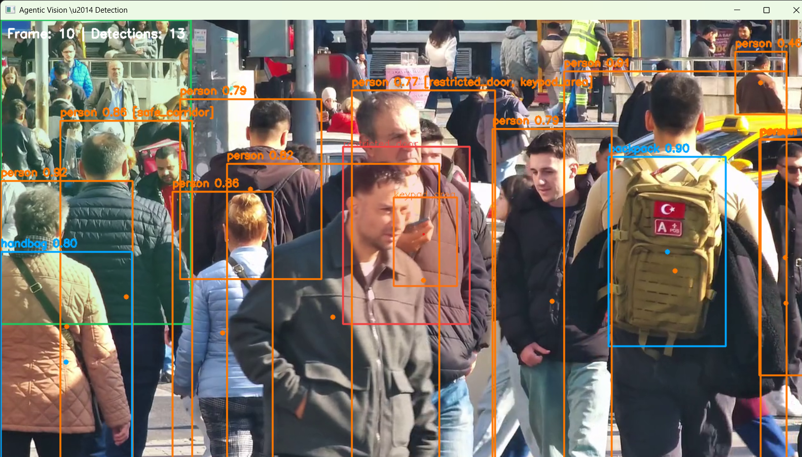

<div align="center">

# 🧠 Eagle - Agentic Vision Surveillance System

### *Moving from Object Detection to Intent Inference*

[](https://gssoc.girlscript.tech)
[](https://python.org)
[](https://fastapi.tiangolo.com)
[](https://nextjs.org)
[](LICENSE)
[](CONTRIBUTING.md)

<br/>

**Traditional CV detects → Eagle *understands*.**

Traditional systems say `"Person detected"`.  
Eagle says `"A person is loitering near the restricted exit and repeatedly looking at the keypad."` 

</a>


https://github.com/user-attachments/assets/54aed374-5172-4c56-8881-b37198cb657f


[📖 Docs](#-documentation) · [🚀 Quick Start](#-quick-start) · [🗺️ Roadmap](#%EF%B8%8F-roadmap) · [🤝 Contribute](#-contributing)

</div>

---

## 📌 Table of Contents

- [What Is This?](#-what-is-this)
- [System Architecture](#-system-architecture)
- [Tech Stack](#-tech-stack)
- [Project Structure](#-project-structure)
- [Quick Start](#-quick-start)
- [API Reference](#-api-reference)
- [Phase-Wise Roadmap](#%EF%B8%8F-roadmap)
- [Contributing (GSSoC 2026)](#-contributing)
- [Known Challenges](#-known-challenges)
- [License](#-license)

---

## 🔍 What Is This?

**Eagle** is an open-source, production-grade surveillance AI system built for **GSSoC 2026**.

Instead of rigid, rule-based alerts like:
> ❌ `IF person near door > 10 sec → ALERT`

It uses a multimodal AI pipeline to produce:
> ✅ `Label: Suspicious | Confidence: 0.89 | Reason: "Repeated interaction with access-control keypad suggests attempted unauthorized entry."`

### What Makes It "2026-Level"?

| Feature | Traditional CV | Agentic Vision |
|---|---|---|
| Output | `"Object: Person"` | `"Action: Attempted Tailgating"` |
| Detection | Rule-based thresholds | Zero-shot semantic reasoning |
| Time awareness | Single-frame | 10–30 second temporal windows |
| Alerts | Binary codes | Natural language explanations |
| Adaptability | Requires retraining | Configurable via YAML policies |

---

## 🏗️ System Architecture

```
┌─────────────────────────────────────┐
│        CAMERA STREAM / VIDEO        │
└──────────────────┬──────────────────┘
                   │
                   ▼
┌─────────────────────────────────────┐
│   DETECTION SERVICE  (YOLOv8/v9)   │  services/detection/
│   Person, Door, Keypad, Bag ...    │
└──────────────────┬──────────────────┘
                   │
                   ▼
┌─────────────────────────────────────┐
│   TRACKING SERVICE  (ByteTrack)    │  services/tracking/
│   Person ID: #1, Trajectory, Age  │
└──────────────────┬──────────────────┘
                   │
                   ▼
┌─────────────────────────────────────┐
│   TEMPORAL MEMORY  (Redis Buffer)  │  services/memory/
│   Last 50 events per track_id      │
└──────────────────┬──────────────────┘
                   │
         ⚡ Event Trigger
         (only on zone entry, not every frame)
                   │
                   ▼
┌─────────────────────────────────────┐
│   VLM CAPTIONING  (LLaVA-Next)     │  services/reasoning/
│   "Describe what person is doing"  │
└──────────────────┬──────────────────┘
                   │
                   ▼
┌─────────────────────────────────────┐
│   LLM REASONING LAYER              │
│   Label: Suspicious / Normal       │
│   Reason: Natural language text    │
└──────────────────┬──────────────────┘
                   │
                   ▼
┌─────────────────────────────────────┐
│   FASTAPI BACKEND  +  NEXT.JS UI   │  apps/
│   REST API  |  Real-time Dashboard │
└─────────────────────────────────────┘
```

### Service Breakdown

| Component | Technology | Responsibility |
|---|---|---|
| **Detection** | YOLOv8/v9 (Ultralytics) | Detect persons, objects, and restricted zones per frame |
| **Tracking** | ByteTrack / DeepSORT | Assign persistent IDs across frames; log dwell time |
| **Memory** | Redis 7 (ring buffer) | Store last 50 events per `track_id`; TTL on idle tracks |
| **VLM Layer** | LLaVA-Next / Qwen-VL | Generate natural language frame descriptions on event trigger |
| **LLM Reasoning** | Mixtral / GPT-4o / Gemini | Classify intent from caption sequence; output label + reason |
| **Backend API** | FastAPI + Celery | Async REST API; task queue for slow VLM/LLM calls |
| **Frontend** | Next.js 14 + TypeScript | Live video, bounding box overlay, alert panel, timeline |

---

## ⚙️ Tech Stack

| Layer | Technology | Why |
|---|---|---|
| Vision Backbone | YOLOv8 / YOLOv9 | Best speed/accuracy trade-off; huge ecosystem |
| Object Tracking | ByteTrack (primary), DeepSORT | Faster & more accurate in crowded scenes |
| Temporal Memory | Redis 7 | Sub-ms latency; native list ops; TTL support |
| Vision-Language | LLaVA-Next via Ollama | Open-source, runs locally, no API cost |
| LLM Reasoning | Mixtral-8x7B / GPT-4o | Configurable per cost/quality requirements |
| Backend | FastAPI + Uvicorn | Async, auto-docs, Pydantic, fastest Python API |
| Task Queue | Celery + Redis | Decouples slow VLM/LLM from real-time pipeline |
| Frontend | Next.js 14 + TypeScript | App Router, SSE, type safety, Tailwind |
| Containers | Docker + docker-compose | One-command setup for all contributors |
| CI/CD | GitHub Actions | Free for open source; native GitHub integration |
| Optimization | ONNX Runtime (INT8) | 2–4× speed-up without retraining |

---

## 📂 Project Structure

```
Eagle/
│
├── apps/
│   ├── backend/                # FastAPI main server
│   │   ├── main.py
│   │   ├── routes/
│   │   └── tasks.py            # Celery async tasks
│   └── dashboard/              # React 19 + Vite dashboard
│       ├── src/
│       │   └── components/
│       │       └── ZoneEditor.tsx
│       ├── index.html
│       └── vite.config.js
│
├── services/
│   ├── detection/
│   │   ├── detector.py         # YOLOv8/v9 inference
│   │   └── zones.py            # Restricted area polygons
│   ├── tracking/
│   │   └── tracker.py          # ByteTrack / DeepSORT
│   ├── reasoning/
│   │   ├── vlm.py              # Frame captioning (LLaVA-Next)
│   │   ├── llm.py              # Temporal reasoning
│   │   └── prompts.py          # Prompt templates
│   └── memory/
│       └── memory.py           # Redis ring buffer
│
├── libs/
│   ├── schemas/                # Pydantic models
│   ├── utils/                  # Frame processing helpers
│   └── config/                 # Env loaders, model configs
│
├── infra/
│   ├── docker/
│   └── k8s/                    # Kubernetes (optional)
│
├── data/
│   ├── sample_videos/
│   └── logs/
│
├── docs/                       # Architecture docs, ADRs
├── tests/                      # Unit + integration tests
├── .github/                    # CI/CD, issue templates
├── README.md
├── CONTRIBUTING.md
└── ROADMAP.md
```

---

## 🚀 Quick Start

### Prerequisites

- Python 3.11+
- Node.js 18+
- Docker + Docker Compose
- [Ollama](https://ollama.ai) (for local LLaVA-Next)


## ⚡ Quick Start (with Make)

> All commands are available via `make`. Run `make help` for the full list.

```bash
make install   # install dependencies
make up        # start services
make demo      # run the demo
```

## 🛠 Developer Commands

| Command | Description |
|---|---|
| `make install` | Install backend dependencies |
| `make install-frontend` | Install npm dependencies in apps/dashboard |
| `make setup` | Full dev setup (backend + frontend) |
| `make test` | Run pytest suite |
| `make lint` | Run ruff and black checks |
| `make coverage` | Run tests with coverage |
| `make up` | Start docker services |
| `make down` | Stop docker services |
| `make demo` | Run detection demo |
| `make clean` | Remove temporary/cache files |
| `make help` | Print usage summary |


## Manual Setup

### 1. Clone the repository

```bash
git clone https://github.com/your-org/eagle.git
cd eagle
```

### 2. Configure environment variables

Copy `.env.example` to `.env` and update the values before running the project.

```bash
cp .env.example .env
```

### 3. Start infrastructure (Redis + backend)

```bash
docker-compose up -d
```

### 4. Install Python dependencies

```bash
cd services/detection
pip install -r requirements.txt
```

### 5. Pull the VLM model (local inference)

```bash
ollama pull llava:latest
```

### 6. Run detection on a sample video

```bash
python services/detection/detection.py --source data/sample_videos/sample.mp4
```
### Detection Demo

The following screenshot shows the object detection pipeline running with annotated bounding boxes.



### 7. Start the backend API

```bash
cd apps/backend
uvicorn main:app --reload --port 8000
```

API docs available at: `http://localhost:8000/docs`

### 8. Start the frontend

```bash
cd apps/dashboard
npm install
npm run dev
```

Dashboard at: `http://localhost:5173`

---

## 📡 API Reference

### `POST /ingest`
Accept a video frame (base64 or file). Runs detection + tracking.

```json
Request:  { "frame": "<base64_string>", "camera_id": "cam_01" }
Response: { "status": "processed", "track_ids": [1, 3, 5] }
```

### `GET /alerts`
Returns paginated alert list with optional filters.

```json
Response: {
  "alerts": [
    {
      "id": "alert_001",
      "track_id": 1,
      "label": "Suspicious",
      "confidence": 0.89,
      "reason": "Repeated interaction with restricted keypad",
      "timestamp": "2026-06-15T10:00:00Z"
    }
  ]
}
```

### `GET /track/{id}`
Returns full event history and reasoning for a given track.

### `POST /feedback`
Human-in-the-loop endpoint to mark an alert as correct or incorrect.

```json
Request: { "alert_id": "alert_001", "correct": false, "note": "Normal employee" }
```

---

## 🗺️ Roadmap

| Week | Phase | Milestone |
|---|---|---|
| Week 1 | Detection | YOLOv8 on sample video; bounding boxes at 15+ FPS |
| Week 2 | Tracking | ByteTrack assigns persistent IDs; dwell time logged |
| Week 3 | Memory | Redis ring buffer operational; sequences queryable |
| Week 4 | VLM | LLaVA-Next producing frame captions on event trigger |
| Week 5 | LLM Reasoning | Caption sequence → Suspicious/Normal + explanation |
| Week 6 | API | FastAPI live; all endpoints tested; Docker working |
| Week 7 | Frontend | Next.js dashboard with live video, alerts, timeline |
| Week 8 | Launch | Optimized, documented, CI live, 20+ GSSoC issues |

**Post-GSSoC (v2.0+):**
- Long-term memory via vector DB (Qdrant/Chroma)
- Graph-based spatial reasoning (person ↔ object ↔ zone)
- Multi-camera feed fusion
- Self-improving feedback loop for fine-tuning

---

## 🤝 Contributing

This project is part of **GSSoC 2026**. All contributors are welcome!

See [CONTRIBUTING.md](CONTRIBUTING.md) for the full guide.

### Quick contribution map:

| Task | Difficulty | Label |
|---|---|---|
| Write unit tests for detection schema | 🟢 Beginner | `easy` |
| Add README setup GIFs | 🟢 Beginner | `docs` |
| Create docker-compose for Redis + backend | 🟢 Beginner | `devops` |
| Implement restricted zone polygon editor (UI) | 🟡 Intermediate | `feature` |
| Add Qwen-VL as alternative VLM backend | 🟡 Intermediate | `AI/ML` |
| Implement risk scoring algorithm | 🔴 Advanced | `AI/ML` |
| Add ONNX INT8 quantization for YOLO | 🔴 Advanced | `optimization` |

---

## ⚠️ Known Challenges

| Challenge | Mitigation |
|---|---|
| **VLM Hallucination** | Cross-check VLM output against YOLO detections |
| **High VLM Latency** | Event-triggered: VLM runs once per 5s per track, not every frame |
| **Ambiguous "Suspicious"** | Configurable YAML behavior policies + human review |
| **Track ID Switches** | ByteTrack re-ID; increase `max_age`; appearance-based re-ID |
| **Privacy Concerns** | Face-blur mode by default; GDPR note in docs |

> **Important framing:** This system performs *probabilistic intent inference* using multimodal reasoning — not true intent understanding. Always treat it as a decision-support tool. Human review of all high-stakes alerts is required.

---

## 📜 License

MIT License — see [LICENSE](LICENSE) for details.

---

<div align="center">

**Built with ❤️ for GSSoC 2026**

[⭐ Star this repo](https://github.com/your-org/agentic-vision) · [🐛 Report a Bug](https://github.com/your-org/agentic-vision/issues) · [💡 Request a Feature](https://github.com/your-org/eagle/issues)

</div>
