# Pipeline Performance Benchmark Report

**Model Used for Core Detection:** `yolov8n_int8_openvino_model`
**Workload Processing Source:** `Real Video Asset`
**Total Execution Time:** 10.39 seconds

## Performance Metrics

| Metric | Measured Value | Unit | Target / Goal |
| :--- | :--- | :--- | :--- |
| **Detection Throughput** | 26.62 | FPS | Higher is better (>30) |
| **Tracking Overhead** | 11.73 | ms/frame | Lower is better (<10) |
| **Redis Write Latency** | 14.18 | ms | Lower is better (<5) |
| **VLM Captioning Time** | 0.36 | seconds | Lower is better |
| **LLM Reasoning Time** | 0.56 | seconds | Lower is better |
| **Total End-to-End Latency** | 103.29 | ms per event | Real-time efficiency |
| **Peak RAM Usage** | 418.02 | MB | Resource boundary check |

## Timeline Chart

```mermaid
gantt
    title Component Pipeline Relative Latency Breakup
    dateFormat  X
    axisFormat %s
    section Main Pipeline
    Detection Engine (ms)      :active, 0, 38
    Tracking Engine (ms)       : 38, 49
    Database Sync (ms)         : 49, 63
    section Heavy Processing
    VLM Ingestion (ms)         : 63, 422
    LLM Context Inference (ms) : 422, 979
```

